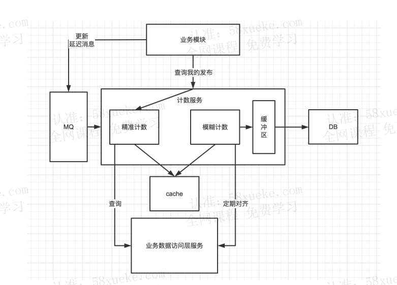
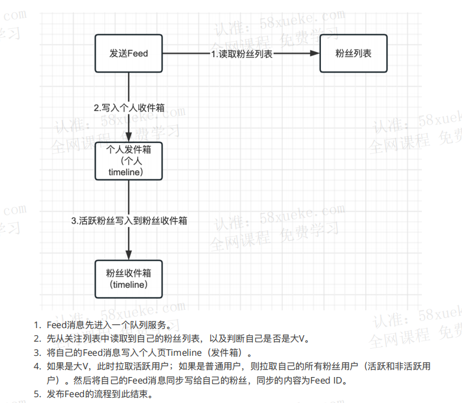
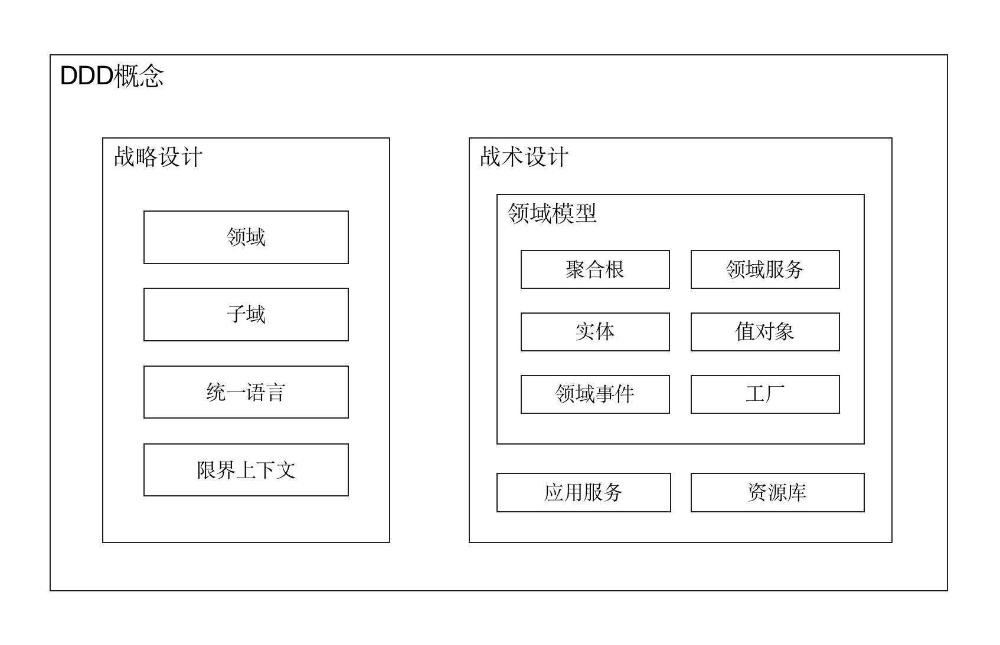
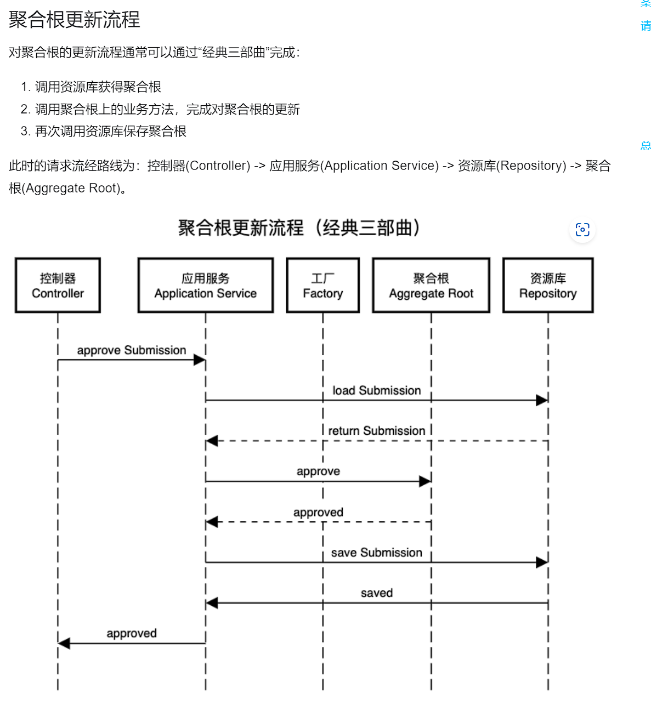
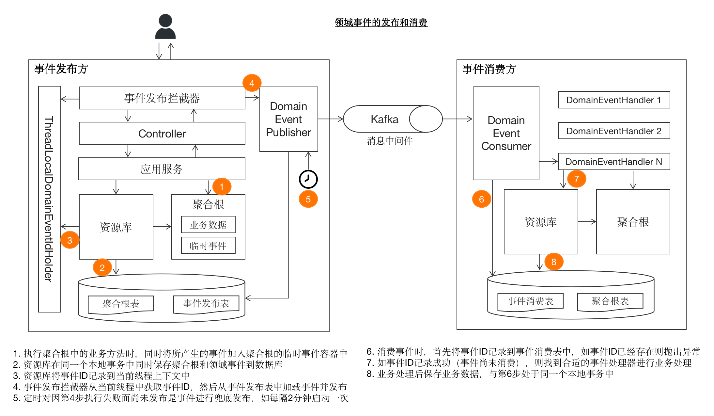
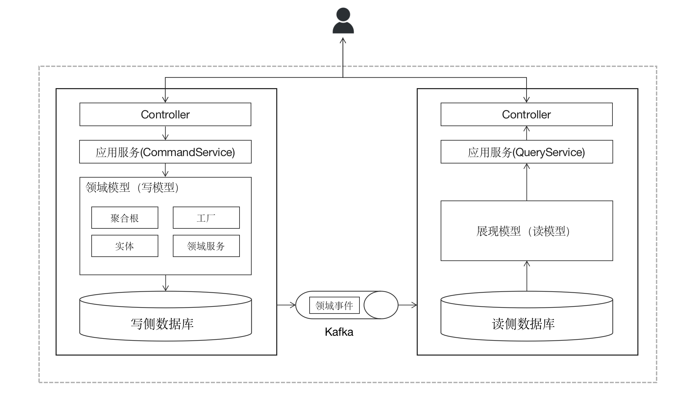

# myxhs
项目描述:该项目旨在模仿小红书的社区主体功能，着重采用领域驱动设计（DDD）和CQRS原则，采用多种缓存设计，旨在构建一个易于维护和扩展的短视频、图文社区，以满足千万级流量的高并发需求。项目的核心在于实现用户对内容的点赞、关注、浏览、评论等行为，以及用户间的社交互动功能。通过分库分表和读写分离，应用热点探测和缓存技术，采用事件驱动架构和异步处理等方式，以提升系统的性能和可扩展性。

